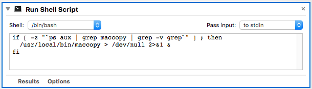

10 November 2018  

## macXcopy - X mouse copy for macOS
This includes a hack of [https://github.com/lodestone/macpaste](https://github.com/lodestone/macpaste), named `maccopy`.  
`maccopy` *approximates* left mouse button copy implementations by Unix/Linux X11 window managers.  
Unlike X11, `maccopy` alters Mac's *system* clipboard.  
Since, like X11, macOS Terminal uses *a private pasteboard* for X11-style copy and paste,  
a terminal program using the system clipboard is wanted;  [iTerm2](https://iterm2.com/) works...  

**macXcopy** also involves [a JSON file](KarabinerButton3.json) for [Karabiner Elements](https://pqrs.org/osx/karabiner/) to implement:  
- X `mouse middle-button` pastes from macOS clipboard to macOS applications *other than* Safari, Firefox and Chrome web browsers,  
  for which `mouse middle-button` opens hyperlinks in new tabs.  
- `[command]+[mouse middle-button]` pastes to Safari, Firefox and Chrome web browsers.

- first, highlight arbitrary text or other elements by double-click or drag with left button depressed,
- then `[control]+c`, or `mouse middle-button` if using customized Karabiner, to paste those elements in the same or another window.  
  Developing muscle memory to press `[control]` for selecting between *paste* or *URL  in new tab* for **Google Chrome** becomes a goal.. 

It works well fairly on macOS 10.13 **High Sierra** for me with [MacVim](https://macvim-dev.github.io/macvim/), [iTerm2](https://iterm2.com/), and [Google Chrome](https://www.google.com/chrome/).  

#### details
This program works *only* with applications that support key combination `[command]+c` for copy to macOS clipboard,  
because `maccopy` simply: 

- for left button double-click or pointer drag with left button depressed, *note selection*. 
- for left mouse button releases *after selection noted*, posts `[command]+[c]` down & up (to copy selected elements).  
  Note that *selected* element is copied even if not highlighted.

For different `mouse-button` double-click or debounce timing and/or left-handed or otherwise remapped mouse button, edit the C program and `make`.  

## HowTo
Install [Karabiner Elements](https://pqrs.org/osx/karabiner/) and copy [`KarabinerButton3.json`](KarabinerButton3.json) to `~/.config/karabiner/assets/complex_modifications`,  
then open `Karabiner-Elements Preferences > Complex Modifications > Rules > Add rule`

Run `maccopy` in the foreground from e.g. Terminal  
or run `macXcopy.sh` to launch it in the background  
or
```
$ sudo cp macXcopy/maccopy /usr/local/bin/
Password:
```
... and add `macXcopy.app` as a startup "Login Item"  
`(System Preferences > Users & Groups > Login Items` **[+]** *Navigate to file*).

## Building maccopy
    `make`

### Building for debug
    `make debug`

### Testing
    `./maccopy`

### Building macXcopy.app
macOS does not support adding a plain bash script file as a startup "Login Item".  
**macXcopy.app** is simply a bash script diguised as a macOS .app by [Automator.app](https://support.apple.com/guide/automator/welcome/mac):  


## License


###  See [these GitHub Pages](https://blekenbleu.github.io/VimTXmouse) for related documentation 
